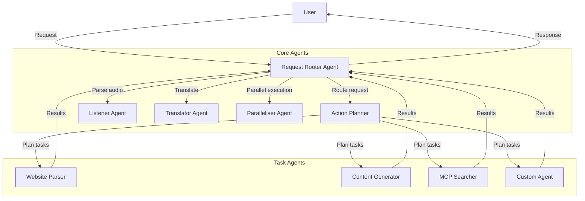

# Multi-Agent Architecture

## Overview

The multi-agent architecture extends the core Agentic-AI framework to support specialized agents that work together to handle complex user requests. Each agent is designed for a specific purpose, communicating through a centralized coordination system.

## Architecture Diagram

## Agent Descriptions

### Core Agents

1. **Orchestrator**

   - Acts as the entry point for all user requests
   - Analyzes requests and routes them to appropriate specialized agents
   - Coordinates responses from multiple agents
   - Manages the overall conversation flow
   - Analyzes complex requests and breaks them down into subtasks
   - Determines which agents and tools are needed for each subtask
   - Creates execution plans with dependencies between tasks
   - Handles task prioritization and sequencing
   - Identifies tasks that can be executed in parallel
   - Distributes subtasks to appropriate agents
   - Manages concurrency and resource allocation
   - Aggregates and synchronizes results from parallel operations-

2. **Listener**

   - Processes audio input and converts it to text
   - Handles speech recognition and language identification
   - Extracts audio metadata (speaker identification, emotion detection)
   - Interfaces with audio processing tools and APIs

3. **Translator**

   - Translates content between languages
   - Maintains context and intent across translations
   - Adapts content for cultural differences
   - Handles specialized technical or domain-specific terminology

4. **Tool finder**

   - Identifies relevant MCPs (Model-Centric Processes) for tasks
   - Interfaces with MCP registries and APIs
   - Evaluates MCP capabilities against task requirements
   - Handles MCP authentication and integration

### Task Agents

4. **Website Parser**

   - Searches and extracts information from websites
   - Follows links intelligently to find relevant content
   - Analyzes text, images, and structured data
   - Prioritizes content based on relevance to the user's request

5. **Content Generator**
   - Creates multimedia content (images, videos, audio, diagrams)
   - Interfaces with generation models and APIs
   - Tailors content to user specifications
   - Optimizes content for various formats and platforms

## Implementation Approach

### Phase 1: Core Infrastructure

1. **Agent Interface & Base Classes**

   - Create `AgentInterface` protocol defining common agent methods
   - Implement `BaseAgent` class with shared functionality
   - Develop communication protocols between agents

2. **Agent Registry & Factory**

   - Build registry for dynamically registering/discovering agents
   - Create factory for instantiating appropriate agents
   - Implement dependency injection for agent configuration

3. **Request Rooter Implementation**
   - Develop the central coordination logic
   - Implement request analysis capabilities
   - Create routing mechanisms to specialized agents

### Phase 2: Core Agents

1. **Action Planner**

   - Implement task decomposition algorithms
   - Create task dependency graph management
   - Build execution planning capabilities

2. **Paralleliser**
   - Implement concurrent task execution framework
   - Develop resource management and throttling
   - Create result synchronization mechanisms

### Phase 3: Specialized Agents

1. **Listener & Translator**

   - Integrate with speech recognition services
   - Implement translation capabilities
   - Build domain-specific adaptation features

2. **Website Parser**

   - Implement intelligent web crawling
   - Develop relevance scoring algorithms
   - Create content extraction and summarization

3. **Content Generator**
   - Integrate with generation models and APIs
   - Implement format conversion and optimization
   - Build quality assurance capabilities

### Phase 4: Integration & Optimization

1. **End-to-End Testing**

   - Create comprehensive test scenarios
   - Build automated testing framework
   - Implement performance benchmarking

2. **Monitoring & Logging**

   - Develop agent activity logging
   - Implement performance metrics collection
   - Create visualization and analysis tools

3. **Optimization**
   - Profile and optimize communication overhead
   - Implement caching and memoization
   - Refine agent selection and routing logic

## Technical Considerations

### Agent State Management

Agents can operate in different modes:

- **Stateless**: Each invocation is independent
- **Conversational**: Maintains context across interactions
- **Persistent**: Retains state across sessions

Implementation considerations:

- Use dependency injection for state management
- Define clear state serialization/deserialization
- Implement state expiration policies

### Communication Patterns

Support multiple communication patterns:

- **Request-Response**: Simple synchronous interaction
- **Publish-Subscribe**: Event-driven asynchronous communication
- **Stream Processing**: Continuous data flow processing

Implementation considerations:

- Use message queues for asynchronous communication
- Implement backpressure mechanisms
- Support both in-memory and distributed communication

### Security & Isolation

Ensure proper security boundaries:

- Implement agent permission system
- Verify cross-agent communication authorization
- Sandbox external tool execution

Implementation considerations:

- Define fine-grained permission model
- Implement secure token-based authentication
- Create audit logging for all agent actions

## Integration with Existing Framework

The multi-agent architecture integrates with the existing Agentic-AI framework:

1. **AIBase Extensions**

   - Extend AIBase to support agent-specific functionality
   - Maintain backward compatibility with existing code
   - Add agent communication capabilities

2. **Tool Integration**

   - Ensure all agents can access the tool registry
   - Extend tool management for agent-specific tools
   - Implement agent-to-tool authorization

3. **Provider Compatibility**
   - Support different provider capabilities across agents
   - Allow agent-specific provider configuration
   - Implement fallback mechanisms for provider limitations

## Next Steps

1. Create detailed specifications for each agent
2. Implement the agent interfaces and base classes
3. Develop the Request Rooter as initial integration point
4. Build agent registry and discovery mechanisms
5. Implement the Action Planner for task decomposition

## Related Documentation

- [Agent Implementation Standards](implementation_standards.md) - Coding standards and best practices for implementing agents
- [Agent Specifications](agent_specifications.md) - Detailed specifications for each agent type
- [Implementation Plan](implementation_plan.md) - Phased plan for implementing the multi-agent architecture
